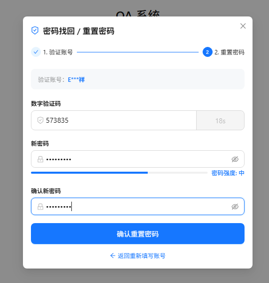
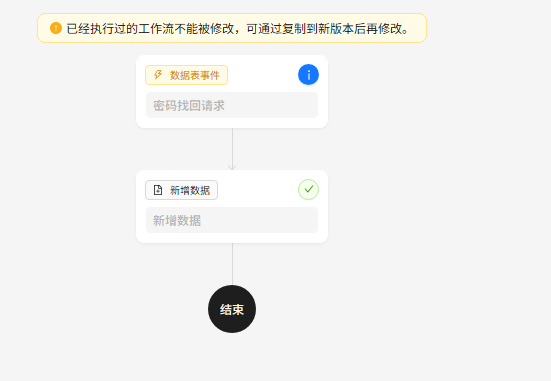
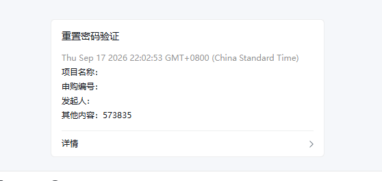
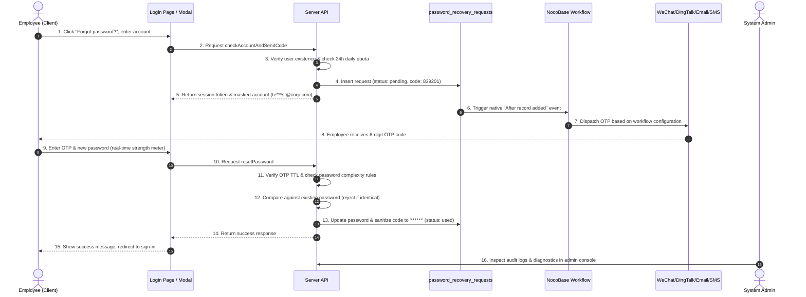

# @nocobase/plugin-password-recovery

<p align="center">
  <a href="https://www.nocobase.com/">
    
  </a>
</p>

<h3 align="center">Enterprise Self-Service Password Recovery & Workflow Integration Plugin for NocoBase</h3>

<p align="center">
  <strong>Tailored for Enterprise Systems: Seamless Login Page Injection · Table Event-Driven Workflows · Multi-Channel OTP Dispatch · Anti-Abuse Rate Limiting · End-to-End Audit Logs</strong>
</p>

<p align="center">
  <a href="./README.md">简体中文</a> | <a href="./README.en-US.md">English</a>
</p>

<p align="center">
  
  
  
  
  
</p>

---

## 📸 Production Screenshots

<div align="center">
  <table border="0">
    <tr>
      <td align="center" valign="top" width="33.3%">
        
        <br />
        <strong>1. Password Recovery Wizard</strong>
        <br />
        <span style="font-size:12px; color:#666;">2-Step Flow · Account Masking · Real-time Strength Meter</span>
      </td>
      <td align="center" valign="top" width="33.3%">
        
        <br />
        <strong>2. Event-Driven Workflow Canvas</strong>
        <br />
        <span style="font-size:12px; color:#666;">Collection Event · password_recovery_requests · Auto Dispatch</span>
      </td>
      <td align="center" valign="top" width="33.3%">
        
        <br />
        <strong>3. Multi-Channel Instant Delivery</strong>
        <br />
        <span style="font-size:12px; color:#666;">WeChat Work / DingTalk / Email / In-App Notification</span>
      </td>
    </tr>
  </table>
</div>

---

## 📖 Background & Problem Statement

In internal enterprise IT operations, **"Employees forgetting login passwords"** is a constant friction point:
1. **High Manual IT Overhead**: Staff must contact system administrators to reset passwords manually, resulting in delayed turnaround and unnecessary communication costs.
2. **Lack of Automated Multi-Channel Reach**: Modern enterprises rely on corporate communication channels (WeChat Work, DingTalk, Feishu/Lark, Corporate Email, SMS), but conventional systems cannot orchestrate them friction-free.
3. **Weak Password & Security Vulnerabilities**: Manually assigned temporary passwords often get set back to the old password, with no protection against SMS bombing or persistent plain-text verification code leaks.

**`@nocobase/plugin-password-recovery`** bridges this gap. Built natively upon the NocoBase **Modern Client (v2)** architecture and **FlowEngine Table Events**, it delivers a turnkey, secure, and fully auditable self-service password recovery experience without modifying NocoBase core code.

---

## 🌟 Key Features

### 1. 🔐 Omnichannel Login Entry (Dual Client Architecture)
- **Modern Client (v2) Native Enhancement**: Elegantly mounts a "Forgot password?" action right next to the registration link on the `/v/` modern login page, adhering 100% to Ant Design 5 styling;
- **Classic Client (/signin) Compatibility**: Built-in smart DOM observer that automatically adapts to the classic login page, triggering the same unified two-step wizard dialog;
- **Multi-Dimensional Account Lookup**: Supports identification by Username, Corporate Email, or Mobile Phone Number.

### 2. ⚡ Table Event-Driven Workflow Integration (Zero-Code)
- **Table Event Driven**: Once the account is verified, the system automatically inserts a temporary record into `password_recovery_requests`;
- **Native Event Dispatch**: Automatically triggers NocoBase Workflows listening on the **"After record added"** event of this collection;
- **Any Notification Channel**: Effortlessly orchestrate nodes in NocoBase Workflow for **WeChat Work, DingTalk Robots, Feishu Cards, SMTP Email, or SMS gateways (Aliyun/Tencent Cloud)**.

### 3. 🛡️ Financial-Grade Security & Anti-Abuse
- **Anti-Bombing Dual Rate Limiting**:
  - Short-window IP limit (default max 5 requests/min);
  - Single-account 24-hour daily limit (default max 10 requests/day, configurable in admin console) to stop harassment bombing attacks;
- **Automatic Sensitive Code Sanitization**: Once the password is reset, the one-time code in both internal and request tables is immediately overwritten with `******`, eliminating historical credential exposure;
- **Password Complexity Policy**: Admin-configurable "Standard" (must contain both letters and numbers) or "Simple" mode, with a real-time color-coded strength meter (Weak / Medium / Strong) in the UI;
- **Same-Password Prevention**: Compares the new password against the current password hash; identical passwords are strictly rejected;
- **Session Token Isolation & Brute-Force Lockout**: 32-byte cryptographic session tokens; sessions are permanently invalidated after exceeding maximum failed attempts (default 5).

### 4. 📊 Admin Console with Tabs Architecture
- **Settings**: Adjust button text, code length, TTL minutes, max retry attempts, daily account limit, and password complexity rules;
- **Audit Logs**: Read-only tabular view to inspect historical requests, employee identity, contact channel, client IP, timestamp, and status tags (`pending` / `used` / `expired` / `test`);
- **Workflow Diagnostics**: Built-in test console allowing admins to trigger mock requests (`status: 'test'`) with a single click to verify external notifications without logging out.

### 5. 🧱 Standard Database Lifecycle & Housekeeping
- **Standard NocoBase Migration**: Pre-packaged with `src/server/migrations/` for seamless compatibility with `yarn nocobase upgrade`;
- **Automated Data Retention**: Scheduled housekeeping service automatically purges records older than 7 days marked as `used` or `expired`.

---

## 🔄 Architecture & Sequence Flow



---

## 🚀 Quick Start

### 1. Installation & Build

Place the plugin in `packages/plugins/@nocobase/plugin-password-recovery`:

```bash
# 1. Build plugin assets
yarn build @nocobase/plugin-password-recovery

# 2. Enable plugin in NocoBase
yarn nocobase pm enable @nocobase/plugin-password-recovery
```

### 2. Collection Synchronization

Log into NocoBase Admin Console, navigate to **Settings -> Enterprise Password Recovery**:
- Click **[Create / Sync Plugin Collection]** to register the `password_recovery_requests` business collection (12 fields ready for workflow bindings).

---

## 🛠️ Workflow Configuration Guide

Navigate to NocoBase **Workflow**:

### Step 1: Create Trigger
- **Trigger Type**: Select **"Collection Event"**
- **Collection**: Select **"Password Recovery Requests (password_recovery_requests)"**
- **Trigger Condition**: Select **"After record added"**

<div align="center">
  
  <br />
  <span style="font-size:12px; color:#666;">(Production Canvas: Collection Event Trigger -> Create Record / Notification Node -> End)</span>
</div>

> **💡 Note**: As illustrated above, when an employee requests password recovery on the login screen, the plugin automatically creates a secure record containing the dynamic verification code in the `password_recovery_requests` collection. The workflow detects the "After record added" event and immediately routes to downstream nodes (such as sending notifications, emails, or creating in-app message cards) to deliver the code.

### Step 2: Available Variables Reference

| Variable | Field Name | Type | Description |
|---|---|---|---|
| `{{$context.data.code}}` | `code` | String | **Dynamic one-time verification code** (e.g. `839201`) |
| `{{$context.data.account}}` | `account` | String | The account identity entered by the user |
| `{{$context.data.email}}` | `email` | String | User's registered corporate email |
| `{{$context.data.phone}}` | `phone` | String | User's registered mobile phone number |
| `{{$context.data.username}}` | `username` | String | Matched username |
| `{{$context.data.nickname}}` | `nickname` | String | Matched employee full name / nickname |
| `{{$context.data.expiresInMinutes}}` | `expiresInMinutes` | Number | Code validity in minutes (default 5) |
| `{{$context.data.expiresAt}}` | `expiresAt` | DateTime | Expiration timestamp |
| `{{$context.data.ip}}` | `ip` | String | Client IP address of the request |

### Step 3: Notification Node Examples

#### Example A: WeChat Work / DingTalk Robot Webhook (HTTP Request Node)
```json
{
  "msgtype": "markdown",
  "markdown": {
    "content": "### [Security Notification] Password Recovery Code\n> User: <font color=\"comment\">{{$context.data.nickname}} ({{$context.data.username}})</font>\n> Verification Code: <font color=\"warning\">**{{$context.data.code}}**</font>\n> Valid For: {{$context.data.expiresInMinutes}} minutes\n> Client IP: {{$context.data.ip}}\n\n*If this was not requested by you, please contact IT support immediately.*"
  }
}
```

#### Example B: Corporate Email Notification (Send Email Node)
- **To**: `{{$context.data.email}}`
- **Subject**: `[Security Notice] Your One-Time Password Reset Code`
- **Body HTML**:
  ```html
  <div style="font-family: sans-serif; padding: 20px; border: 1px solid #e2e8f0; border-radius: 8px;">
    <h2>Hello, {{$context.data.nickname}}:</h2>
    <p>You have requested to reset your system login password. Here is your verification code:</p>
    <p style="font-size: 28px; font-weight: bold; color: #1677ff; letter-spacing: 4px;">{{$context.data.code}}</p>
    <p style="color: #64748b; font-size: 13px;">This code will expire in {{$context.data.expiresInMinutes}} minutes. Do not share this code with anyone.</p>
  </div>
  ```

---

## 📁 Directory Structure

```text
packages/plugins/@nocobase/plugin-password-recovery/
├── .gitignore                      # Standard git exclusions (dist, node_modules, logs)
├── README.md                       # Chinese documentation
├── README.en-US.md                 # English documentation
├── package.json                    # Package metadata & dependencies
├── build.config.ts                 # Rspack build configuration
├── tsconfig.json                   # TypeScript configuration
├── src/
│   ├── client/                     # V1 classic client integration (/signin)
│   ├── client-v2/                  # V2 modern client integration
│   │   ├── components/             # Enhancers, recovery modals, strength meter
│   │   ├── pages/                  # Three-tab admin settings page
│   │   ├── locale.ts               # Client i18n helpers
│   │   ├── types.ts                # TypeScript interfaces
│   │   └── plugin.tsx              # Client plugin definition
│   ├── locale/                     # Internationalization dictionaries
│   │   ├── zh-CN.json              # Simplified Chinese
│   │   └── en-US.json              # US English
│   └── server/                     # Backend implementation
│       ├── actions/                # Controllers (verification, OTP, policy check, sanitization)
│       ├── collections/            # Schema definitions (configs, records, requests)
│       ├── migrations/             # Standard NocoBase database migrations
│       └── index.ts                # Server plugin class, ACL, housekeeping cron
└── client.d.ts / server.d.ts       # Module declaration exports
```

---

## 🌐 Internationalization (i18n)

Supports seamless real-time switching between:
- Simplified Chinese (`zh-CN`)
- English (`en-US`)

---

## 📄 License

Distributed under the [AGPL-3.0 License](https://www.gnu.org/licenses/agpl-3.0.html).
