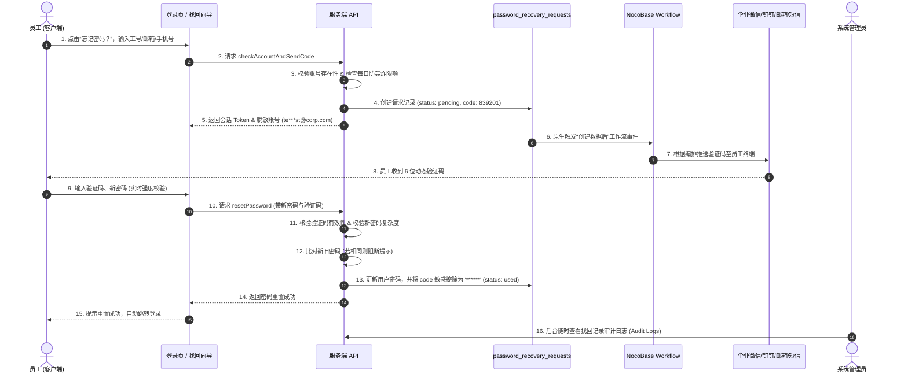

# @nocobase/plugin-password-recovery

<p align="center">
  <a href="https://www.nocobase.com/">
    
  </a>
</p>

<h3 align="center">NocoBase 企业级密码自助找回与工作流联动插件</h3>

<p align="center">
  <strong>专为企业内部系统打造：登录页无缝集成 · 数据表事件驱动工作流 · 多通道验证码触达 · 金融级安全防轰炸 · 全流程运维审计</strong>
</p>

<p align="center">
  <a href="./README.md">简体中文</a> | <a href="./README.en-US.md">English</a>
</p>

<p align="center">
  
  
  
  
  
</p>

---

## 📖 业务背景与痛点

在企业内部数字化系统的日常运维中，**“员工忘记登录密码”** 是高频出现的服务痛点：
1. **人工介入成本高**：员工忘记密码必须联系 IT 或管理员在控制台手动重置，响应滞后且沟通成本高；
2. **缺乏多通道自助触达**：企业员工通常具备企业微信、钉钉、飞书、企业邮箱或短信等已认证通道，传统系统难以低成本串联；
3. **弱口令与安全隐患**：人工随手重置的临时密码容易被二次设置为相同密码，且缺乏防短信轰炸和敏感验证码生命周期擦除。

**`@nocobase/plugin-password-recovery`** 针对上述场景而生。它深度结合 NocoBase 的 **Modern Client (v2)** 架构与 **FlowEngine 数据表事件**，无需侵入核心源码，即可实现全自动、高安全、可审计的企业密码找回闭环。

---

## 🌟 核心特性

### 1. 🔐 全场景端入口注入（双版本无缝支持）
- **Modern Client (v2) 原生增强**：通过 DOM 观察机制在登录表单（`/v/` 现代端）的注册链接右侧优雅挂载“忘记密码？”，保持 100% Ant Design 5 视觉一致性与纯蓝链接体验；
- **经典版客户端 (/signin) 兼容**：内置智能观察器，自动适配旧版登录页，双端统一唤起两步式向导对话框；
- **多维度账号识别**：支持员工输入用户名、企业电子邮箱或手机号任意一种进行身份定位。

### 2. ⚡ 原生工作流事件联动（零代码配置）
- **数据表事件驱动**：账号校验通过后，系统自动向 `password_recovery_requests`（密码找回请求表）写入一条带时效的安全凭证；
- **无缝触发工作流**：原生触发 NocoBase 工作流对该表“**创建数据后**”的监听；
- **任意通道触达**：管理员可在工作流中随心编排**企业微信应用通知、钉钉群机器人、飞书卡片、SMTP 邮件网关、阿里云/腾讯云短信**等任意节点，真正实现“一次触发，随心推送”。

### 3. 🛡️ 金融级安全合规体系
- **防消息轰炸（双维度限流）**：
  - 单 IP 短窗频次限制（默认 1 分钟最多 5 次）；
  - 单员工账号 24 小时最大找回频次上限（默认每天最多 10 次，后台可调），杜绝针对特定员工的骚扰轰炸；
- **敏感验证码自动打码擦除**：密码成功重置后，系统自动将数据库记录中的验证码覆写为 `******`，杜绝数据库历史明文留存；
- **企业密码复杂度策略**：支持配置“标准模式（必须同时包含字母和数字）”与“宽松模式”，前端弹窗即时显示红/蓝/绿密码强度指示条，并在提交弱密码时服务端强制阻断；
- **新旧密码一致性比对**：通过 NocoBase 原生密码比对算法比对新旧密码，相同直接拦截，防止无效重置；
- **会话 Token 隔离与重试熔断**：单次请求生成 32 字节高熵随机 Token，输错达上限（默认 5 次）强制锁死作废。

### 4. 📊 后台运维审计与一键连通性测试（Tabs 架构）
- **参数配置 (Settings)**：可视化调整按钮文字、验证码位数、时效分钟数、重试上限、每日限流及密码策略；
- **找回记录审计 (Audit Logs)**：直观只读表格，实时追溯发起账号、员工姓名、联系方式、客户端 IP、申请时间及状态标签（`待验证` / `已重置` / `已过期` / `模拟测试`）；
- **工作流连通性测试 (Diagnostics)**：管理后台提供模拟触发面板，管理员输入任意账号即可一键写入测试记录并触发工作流，无需退出登录即可验证企微/钉钉/邮件通知是否通畅。

### 5. 🧱 规范化数据库治理与生命周期
- **标准 Migration 迁移**：内置 `src/server/migrations/` 标准迁移脚本，支持 `yarn nocobase upgrade` 流程；
- **定时数据老化清理**：内置定期清理任务，自动将 7 天前已使用（`used`）或已过期（`expired`）的无用记录定期归档清理，保持轻量高效。

---

## 🔄 业务架构与时序图



---

## 🚀 快速开始

### 1. 安装与构建

将插件置于 NocoBase 项目的 `packages/plugins/@nocobase/plugin-password-recovery` 目录下：

```bash
# 1. 编译构建
yarn build @nocobase/plugin-password-recovery

# 2. 启用插件
yarn nocobase pm enable @nocobase/plugin-password-recovery
```

### 2. 插件数据库表就绪

登录 NocoBase 管理后台，进入 **设置 -> 企业密码找回 (Enterprise Password Recovery)**：
- 点击 **【创建 / 同步插件数据库表】** 按钮，系统将自动在数据表管理器中登记 `password_recovery_requests`（密码找回请求表，包含 12 个业务字段）。

---

## 🛠️ 工作流配置指南

进入 NocoBase **【工作流 (Workflow)】** 模块，创建一条通知工作流：

### 第一步：配置触发器
- **触发器类型**：选择 **“数据表事件”**
- **数据表**：选择 **“密码找回请求 (password_recovery_requests)”**
- **触发时机**：选择 **“创建数据后”**

### 第二步：可用变量映射对照表

在工作流的后续节点（如 HTTP 请求、邮件发送等）中，可直接通过变量选择器注入以下参数：

| 工作流变量 | 数据表字段 | 类型 | 说明与典型用途 |
|---|---|---|---|
| `{{$context.data.code}}` | `code` | String | **动态安全数字验证码**（如 `839201`） |
| `{{$context.data.account}}` | `account` | String | 员工在登录页输入的系统账号标识 |
| `{{$context.data.email}}` | `email` | String | 员工绑定的企业邮箱（用于邮件发送节点） |
| `{{$context.data.phone}}` | `phone` | String | 员工绑定的手机号码（用于短信或企微匹配） |
| `{{$context.data.username}}` | `username` | String | 系统用户名 |
| `{{$context.data.nickname}}` | `nickname` | String | 员工姓名 / 称谓 |
| `{{$context.data.expiresInMinutes}}` | `expiresInMinutes` | Number | 验证码有效分钟数（默认 5） |
| `{{$context.data.expiresAt}}` | `expiresAt` | DateTime | 验证码失效截止时间 |
| `{{$context.data.ip}}` | `ip` | String | 发起请求的客户端 IP 地址 |

### 第三步：通知节点编排样例

#### 样例 A：企业微信机器人 Webhook (HTTP 节点)
```json
{
  "msgtype": "markdown",
  "markdown": {
    "content": "### 【系统通知】密码找回动态验证码\n> 员工姓名：<font color=\"comment\">{{$context.data.nickname}} ({{$context.data.username}})</font>\n> 动态验证码：<font color=\"warning\">**{{$context.data.code}}**</font>\n> 有效期限：{{$context.data.expiresInMinutes}} 分钟\n> 发起 IP：{{$context.data.ip}}\n\n*如非本人操作，请及时联系系统管理员。*"
  }
}
```

#### 样例 B：企业电子邮箱通知 (发送邮件节点)
- **收件人**：`{{$context.data.email}}`
- **邮件主题**：`【系统安全中心】您的密码重置动态验证码`
- **正文模板**：
  ```html
  <div style="font-family: sans-serif; padding: 20px; border: 1px solid #e2e8f0; border-radius: 8px;">
    <h2>您好，{{$context.data.nickname}}：</h2>
    <p>您正在申请重置系统登录密码，本次动态验证码为：</p>
    <p style="font-size: 28px; font-weight: bold; color: #1677ff; letter-spacing: 4px;">{{$context.data.code}}</p>
    <p style="color: #64748b; font-size: 13px;">验证码将在 {{$context.data.expiresInMinutes}} 分钟后失效。请勿将验证码泄露给他人。</p>
  </div>
  ```

---

## 🖥️ 管理后台功能一览

| 标签页 | 核心功能 |
|---|---|
| **参数配置 (Settings)** | 开启/关闭自助找回、自定义按钮文字、插件数据库表状态展示与一键同步、密码位数/时效/重试上限设置、单账号每日上限（防轰炸）、密码复杂度模式配置 |
| **找回记录审计 (Audit Logs)** | 实时分页查看员工发起的找回历史，追踪申请员工、联系方式、客户端 IP、发起时间及实时状态（`待验证` / `已重置` / `已过期` / `模拟测试`） |
| **工作流测试诊断 (Diagnostics)** | 内置模拟触发控制台，管理员输入任意账号即可一键向数据表写入测试记录并触发工作流，即时验证各通知通道通畅性 |

---

## 📁 目录结构

```text
packages/plugins/@nocobase/plugin-password-recovery/
├── .gitignore                      # 规范的排除文件（过滤 dist、node_modules 等）
├── README.md                       # 项目说明与配置手册
├── package.json                    # 模块元数据与依赖定义
├── build.config.ts                 # Rspack 打包配置
├── tsconfig.json                   # TypeScript 配置
├── src/
│   ├── client/                     # V1 经典客户端接入（/signin 智能对齐挂载）
│   ├── client-v2/                  # V2 Modern 客户端接入
│   │   ├── components/             # 登录页挂载组件、找回向导对话框、密码强度指示条
│   │   ├── pages/                  # 后台三 Tab 管理页面（参数配置、审计日志、连通性测试）
│   │   ├── locale.ts               # 客户端 i18n 辅助
│   │   ├── types.ts                # TypeScript 类型声明
│   │   └── plugin.tsx              # 插件入口
│   ├── locale/                     # 国际化资源
│   │   ├── zh-CN.json              # 简体中文语言包
│   │   └── en-US.json              # 英文语言包
│   └── server/                     # 服务端核心逻辑
│       ├── actions/                # 业务控制器（账号核验、发码、密码复杂度校验、打码擦除）
│       ├── collections/            # 数据表结构定义（配置表、底层记录表、业务请求表）
│       ├── migrations/             # 规范的 NocoBase 数据库迁移文件
│       └── index.ts                # 服务端插件类、ACL 授权、定时清理与生命周期管理
└── client.d.ts / server.d.ts 等    # 插件模块导出声明
```

---

## 🌐 国际化支持 (i18n)

本插件遵循 NocoBase 原生国际化规范，支持系统级语言即时热切换：
- 简体中文（`zh-CN`）
- 英语（`en-US`）

---

## 📄 许可证

本项目基于 [AGPL-3.0 License](https://www.gnu.org/licenses/agpl-3.0.html) 开源。
