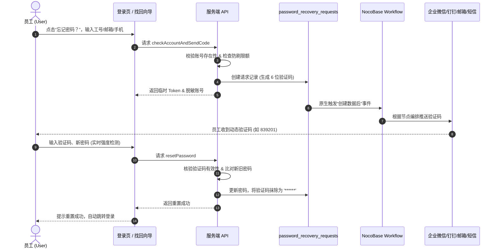

# NocoBase 插件：企业级自助密码找回与工作流联动 (Plugin Password Recovery)

https://github.com/STlxx-lin/nocobase-plugin-password-recovery

我们在使用 NocoBase 作为企业数字化中台或内部系统时，终端员工偶尔会**忘记登录密码**。原生的处理方式往往需要联系 IT 运维或系统管理员进入后台手动修改，既耗费沟通成本，又难以保证响应时效；同时，大多数企业都有现成的**企业微信、钉钉、飞书、企业邮箱或短信通道**，缺乏一个低成本、零代码与这些通道打通的自助找回方案。

为了彻底解决这个痛点，我开发了这套企业级插件 **`@nocobase/plugin-password-recovery`**。

核心思路非常轻量优雅：**无侵入在登录页挂载找回入口 -> 员工输入账号验证身份 -> 插件生成安全记录并原生触发 NocoBase 工作流（数据表事件） -> 工作流通过企业微信/钉钉/邮箱等节点推送 6 位动态验证码 -> 员工输入验证码完成密码重置**。整个链路无需修改 NocoBase 核心源码，并且自带防刷轰炸、弱口令检测与全流程审计。

---

## 📸 全流程实机运行预览

| 1. 登录页密码找回向导 | 2. 工作流事件编排画布 | 3. 终端多通道即时送达 |
| :---: | :---: | :---: |
|  |  |  |
| 两步式向导 · 账号脱敏 · 实时强度检测 | 数据表事件驱动 · 零代码编排 · 自动化流转 | 企业微信 / 钉钉 / 邮件 / 站内通知秒级触达 |

---

## 🌟 核心特性

### 1. 🔐 全渠道登录入口智能挂载 (Dual Client Architecture)
- **现代版登录页 (`/v/`) 原生扩展**：在登录页“注册”旁无侵入注入“忘记密码？”操作入口，纯净遵循 Ant Design 5 设计规范；
- **经典版登录页 (`/signin`) 智能适配**：内置智能 DOM 观察器，完美向下兼容 NocoBase v1 经典版登录页；
- **多维度账号检索**：支持员工通过**用户名、已绑定的企业邮箱、或手机号码**直接找回；
- **前端敏感信息脱敏**：核验通过后，对展示给前端的账号信息实施安全脱敏掩码（如 `te***st@corp.com`），防止界面窥探。

### 2. ⚡ 数据表事件驱动与工作流零代码联动 (Workflow Integration)
- **原生事件驱动**：身份核验后系统自动向 `password_recovery_requests` 集合写入记录；
- **无缝触发工作流**：原生触发 NocoBase 工作流的 **“数据表事件 -> 创建数据后”**，实现 100% 零代码对接；
- **全通道自由编排**：无需编写任何代码，利用工作流原生节点即可将验证码推送到**企业微信机器人 Webhook、钉钉工作通知、飞书卡片、SMTP 邮件服务或短信服务商**；
- **丰富的数据上下文**：工作流下游节点可直接通过变量选择器提取验证码、账号、邮箱、手机号、员工姓名及发起 IP 等字段。

### 3. 🛡️ 金融级防刷与安全风控 (Security & Anti-Abuse)
- **防轰炸双重限流**：
  - **短周期 IP 限频**：默认单 IP 1 分钟内最多请求 5 次，有效阻断恶意脚本并发扫描；
  - **单账号每日限额**：默认单账号每日最多发起 10 次找回，防范短信/邮件轰炸；
- **验证码时效与用后立焚**：
  - 动态验证码具备严格时效机制（默认 5 分钟失效）；
  - 密码重置成功后，历史记录中的验证码字段立即脱敏擦除为 `******`，杜绝凭证泄漏风险；
- **会话级安全隔离**：第一步核验通过后签发有时效的局部 Token，第二步重置密码时强校验，杜绝越权伪造重置请求。

### 4. 🔑 智能密码策略与防弱口令 (Password Policy)
- **实时复杂度检测**：包含长度、大小写字母、数字及特殊字符的实时评分与进度条提示；
- **新旧密码比对**：密码重置时后端自动比对哈希，若新密码与当前旧密码一致则阻断并提示，防止无效重置。

### 5. 📊 完备的操作审计与溯源监控 (Audit Trail)
- **全流程操作审计**：记录找回请求时间、账号、姓名、客户端 IP、User-Agent、消耗时长及最终状态（`pending` / `used` / `expired` / `failed`）；
- 系统管理员可在管理控制台随时审查找回日志，筑牢企业合规防线。

### 6. ⚙️ 管理后台可视化配置与自愈同步 (Admin Console & Auto-Healing)
- **一键就绪**：后台提供【创建 / 同步插件数据库表】功能，自动注册合规元数据与字段映射；
- **智能自愈**：彻底解决 `uiManageable` 冲突，保障工作流字段读取 100% 稳定；
- **内置调试工具**：提供模拟触发工作流功能，一键检测消息通道是否配置畅通。

---

## 🔄 业务全流程流转图



---

## 🛠️ 工作流配置指南

进入 NocoBase **【工作流 (Workflow)】** 模块，创建一条通知工作流：

### 第一步：配置触发器
- **触发器类型**：选择 **“数据表事件”**
- **数据表**：选择 **“密码找回请求 (password_recovery_requests)”**
- **触发时机**：选择 **“创建数据后”**


### 第二步：工作流变量引用对照表

| 工作流变量 | 数据表字段 | 类型 | 说明与典型用途 |
|---|---|---|---|
| `{{$context.data.code}}` | `code` | String | **动态数字验证码**（如 `839201`） |
| `{{$context.data.account}}` | `account` | String | 员工在登录页输入的系统账号标识 |
| `{{$context.data.email}}` | `email` | String | 员工绑定的企业邮箱（用于邮件发送节点） |
| `{{$context.data.phone}}` | `phone` | String | 员工绑定的手机号码（用于短信或企微匹配） |
| `{{$context.data.username}}` | `username` | String | 系统用户名 |
| `{{$context.data.nickname}}` | `nickname` | String | 员工姓名 / 称谓 |
| `{{$context.data.expiresInMinutes}}` | `expiresInMinutes` | Number | 验证码有效分钟数（默认 5） |
| `{{$context.data.expiresAt}}` | `expiresAt` | DateTime | 验证码失效截止时间 |
| `{{$context.data.ip}}` | `ip` | String | 发起请求的客户端 IP 地址 |

### 第三步：通知节点编排样例

#### 样例：企业微信机器人 Webhook (HTTP 节点)
```json
{
  "msgtype": "markdown",
  "markdown": {
    "content": "### 【安全通知】密码找回动态验证码\n> 员工姓名：<font color=\"comment\">{{$context.data.nickname}} ({{$context.data.username}})</font>\n> 动态验证码：<font color=\"warning\">**{{$context.data.code}}**</font>\n> 有效期限：{{$context.data.expiresInMinutes}} 分钟\n> 发起 IP：{{$context.data.ip}}\n\n*如非本人操作，请及时联系系统管理员。*"
  }
}
```

---

## 🚀 快速开始

### 1. 安装与启用

将插件置于 NocoBase 项目的 `packages/plugins/@nocobase/plugin-password-recovery` 目录下：

```bash
# 1. 编译构建
yarn build @nocobase/plugin-password-recovery

# 2. 启用插件
yarn nocobase pm enable @nocobase/plugin-password-recovery
```

### 2. 插件数据库表就绪

登录 NocoBase 后台，进入 **设置 -> 企业密码找回 (Enterprise Password Recovery)**：
- 点击 **【创建 / 同步插件数据库表】** 按钮，系统自动初始化 `password_recovery_requests` 表并注册元数据；
- 随后前往工作流模块配置通知流，即可正式投入使用。

---

## 📦 项目开源地址与 Release 下载

- **GitHub 仓库**：[https://github.com/STlxx-lin/nocobase-plugin-password-recovery](https://github.com/STlxx-lin/nocobase-plugin-password-recovery)
- **最新版本**：`v0.1.0-beta.4`
- **下载 Release 压缩包**：
  - [plugin-password-recovery-v0.1.0-beta.4.zip](https://github.com/STlxx-lin/nocobase-plugin-password-recovery/releases/download/v0.1.0-beta.4/plugin-password-recovery-v0.1.0-beta.4.zip)
  - [plugin-password-recovery-v0.1.0-beta.4.tgz](https://github.com/STlxx-lin/nocobase-plugin-password-recovery/releases/download/v0.1.0-beta.4/plugin-password-recovery-v0.1.0-beta.4.tgz)

欢迎各位在实际业务场景中使用与交流反馈，如有任何问题也欢迎在 GitHub Issue 或本帖下留言讨论！
